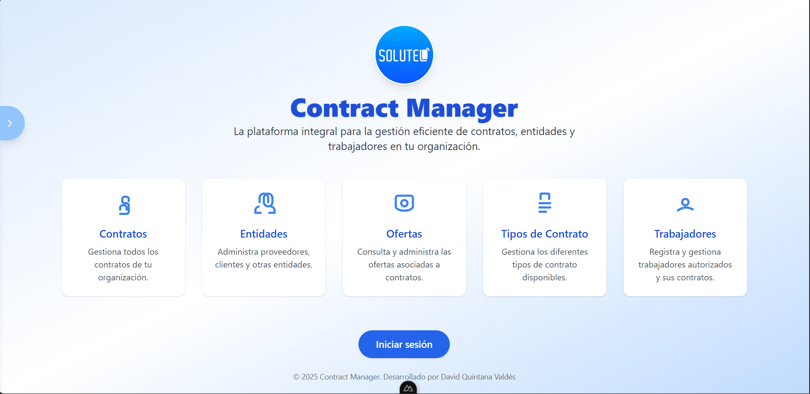

# Contract Manager

<div align="center">
	
	<p><em>Vista del software</em></p>
</div>
Proyecto "Contract Manager" — sistema para gestionar contratos, ofertas, entidades, trabajadores y usuarios.

Resumen:
- **Backend:** API REST con Node.js, Express y Sequelize (PostgreSQL).
- **Frontend:** Aplicación web con Nuxt 3 (Vue 3) y Tailwind CSS.

Estructura principal del repositorio (carpeta raíz `Contract-Manager`):

- `BackEnd/` - Código del servidor (API, modelos, controladores, rutas, helpers). Esta carpeta se mantiene principalmente en la rama `backend`.
- `FrontEnd/` - Aplicación web Nuxt 3 (páginas, componentes, assets). Esta carpeta se mantiene principalmente en la rama `frontend`.
- `Contract-Manager/` - Archivos extra del proyecto (diagramas, SQL de BD, presentaciones y documentación adicional).

Importante sobre ramas Git:
- El repositorio usa ramas dedicadas para cada parte del proyecto. La carpeta raíz `Contract-Manager/` está en la rama `main`. Las implementaciones completas del backend y frontend están en las ramas `backend` y `frontend` respectivamente.

Ejemplos de comandos Git para trabajar con las ramas:

```bash
# clonar el repositorio
git clone <url-del-repo>
cd <repo-folder>/Contract-Manager

# trabajar con la rama del backend
git fetch origin
git checkout backend
cd BackEnd

# trabajar con la rama del frontend (en otra terminal o después de cambiar ramas)
git checkout frontend
cd FrontEnd
```

Quick start (desarrollo) — instrucciones corregidas:

1) Backend (rama `backend`)

```bash
# cambiar a la rama backend y entrar a la carpeta
git checkout backend
cd BackEnd
# instalar dependencias (usa npm)
npm install
# crear un archivo .env en BackEnd/ con las variables necesarias
# variables típicas: PORT, DB_HOST, DB_USER, DB_PASS, DB_NAME, JWT_SECRET, CORS_OPTIONS
npm run dev
```

Notas backend:
- El servidor escucha por defecto en `PORT` (si no está en .env usa `4000`).
- Documentación interactiva Swagger disponible en `/api-docs` una vez corriendo el servidor.

2) Frontend (rama `frontend`)

```bash
# cambiar a la rama frontend
git checkout frontend
cd FrontEnd
# instalar dependencias (yarn es el package manager recomendado por el proyecto)
yarn install
# o si prefieres npm
# npm install

# ejecutar en modo desarrollo
yarn dev
# o con npm
# npm run dev
```

Notas frontend:
- La aplicación usa `NUXT_PUBLIC_BACKEND_HOST` para apuntar al backend. Puedes exportarla localmente antes de iniciar el frontend.

Exportar variable de entorno (Bash / WSL / Git Bash):

```bash
export NUXT_PUBLIC_BACKEND_HOST=http://localhost:4000
```

Exportar variable de entorno (PowerShell - Windows):

```powershell
$env:NUXT_PUBLIC_BACKEND_HOST = "http://localhost:4000"
```

Instalación en Windows (PowerShell / CMD):

```powershell
# Con npm
npm install

# Con yarn (si está instalado globalmente)
yarn install
```

- Frontend por defecto en `http://localhost:3000`.

Sección: Herramientas utilizadas

- **Node.js**: plataforma de ejecución para el backend.
- **npm / yarn**: gestores de paquetes; `yarn` recomendado para el frontend.
- **Express**: framework HTTP para el backend.
- **Sequelize**: ORM para PostgreSQL (modelos y relaciones).
- **PostgreSQL**: base de datos relacional (archivo SQL en `Contract-Manager/8-1-2025.sql`).
- **Nuxt 3 / Vue 3**: framework y librería para el frontend.
- **Tailwind CSS**: framework de utilidades CSS para el frontend.
- **Swagger (swagger-jsdoc + swagger-ui-express)**: documentación automática de la API.
- **Winston**: logging en backend.
- **bcrypt / jsonwebtoken**: autenticación y manejo de contraseñas/ tokens.
- **Leaflet, Chart.js, ExcelJS, jspdf**: librerías usadas en el frontend para mapas, gráficos y exportes.

Sección: Principales vistas (Frontend)

- **Inicio / Dashboard:** vista principal con resumen de contratos y estadísticas.
- **Listado de Trabajadores:** tabla con trabajadores y búsqueda/filtrado.
- **Gestión de Ofertas:** formularios para crear/editar ofertas y ver descripciones asociadas.
- **Gestión de Contratos:** creación y listado de contratos, vinculación con trabajadores.
- **Entidades:** CRUD de entidades relacionadas con contratos/ofertas.
- **Autenticación / Perfil:** login de usuarios y gestión de perfil; rutas protegidas mediante JWT.

URLs útiles:
- API local por defecto: `http://localhost:4000`
- Frontend local por defecto: `http://localhost:3000`
- Documentación Swagger (Backend): `http://localhost:4000/api-docs`

Siguientes pasos:
- Revisar `BackEnd/README.md` y `FrontEnd/README.md` (si existen) para instrucciones detalladas de variables de entorno, despliegue y documentación de endpoints/vistas.

Si quieres, puedo:
- Generar `BackEnd/README.md` y `FrontEnd/README.md` más completos desde lo que ya existe en el código.
- Añadir ejemplos de `.env` (plantillas) y scripts de Docker para despliegue.

Galería de imágenes del proyecto (carpeta `Contract-Manager/`)

<div align="center">
	
	<p><em>Diagrama lógico de la BD</em></p>
</div>
