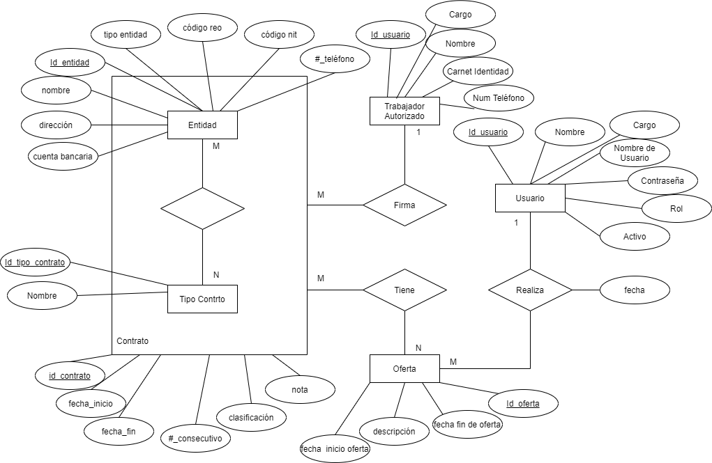

# Backend - Gestión de Contratos y Ofertas

Este es el backend de un sistema de gestión de contratos, ofertas y entidades. Proporciona una API REST completa con autenticación JWT, documentación Swagger y base de datos PostgreSQL.

## 🚀 Características

- **API REST** con Express.js
- **Autenticación JWT** para seguridad
- **Base de datos PostgreSQL** con Sequelize ORM
- **Documentación automática** con Swagger
- **Logging** con Winston
- **Validaciones** robustas en endpoints
- **Gestión de relaciones** entre entidades
- **CORS** configurado para frontend

## 📋 Prerrequisitos

Antes de comenzar, asegúrate de tener instalado:

- **Node.js** (versión 20 o superior)
- **npm** o **yarn**
- **PostgreSQL** (versión 16 o superior)
- **Git**

## 🛠️ Instalación

### 1. Clonar el repositorio

```bash
git clone https://github.com/davidquintanajob/Contract-Manager
cd backend
```

### 2. Instalar dependencias

```bash
# Con npm
npm install

# O con yarn
yarn install
```

### 3. Configurar variables de entorno

Crea un archivo `.env` en la raíz del proyecto:

```bash
# Crear manualmente
touch .env
```

Configura las siguientes variables en el archivo `.env` (ejemplo con comentarios explicativos):

```env
# ----------------------------
# Configuración del servidor
# ----------------------------
# Puerto donde correrá la API (por defecto 4000)
PORT=4000

# Origenes permitidos para CORS. Usar '*' solo en desarrollo.
CORS_OPTIONS=*

# Entorno de ejecución: 'development' o 'production'
ENVIRONMENT=production #development

# ----------------------------
# Configuración de la base de datos (PostgreSQL)
# ----------------------------
# Nombre de la base de datos que usará Sequelize
DB_NAME=GestionDeContratos

# Usuario de la base de datos
DB_USER=postgres

# Contraseña del usuario de la base de datos
DB_PASSWORD=pg

# Host donde corre PostgreSQL (localhost para local)
DB_HOST=localhost

# Puerto de PostgreSQL (por defecto 5432)
DB_PORT=5432

# Dialecto para Sequelize (postgres)
DB_DIALECT=postgres

# ----------------------------
# Configuración de seguridad (JWT)
# ----------------------------
# Clave secreta para firmar tokens JWT (usar valor fuerte en producción)
JWT_SECRET=tu_clave_secreta_jwt_super_segura

# Clave para refresh tokens si los utilizas
REFRESH_TOKEN_SECRET=tu_clave_secreta_refresh_token_super_segura
```

### 4. Configurar la base de datos

1. **Crear la base de datos PostgreSQL:**

```sql
CREATE DATABASE contract_manager;
```

2. **Crear un usuario (opcional):**

```sql
CREATE USER tu_usuario WITH PASSWORD 'tu_password';
GRANT ALL PRIVILEGES ON DATABASE contract_manager TO tu_usuario;
```

3. **Cargar datos de ejemplo desde el archivo .sql (opcional)**

En la rama `main` del repositorio hay un archivo SQL con datos de ejemplo y estructura disponible en `Contract-Manager/8-1-2025.sql`.

Puedes cargarlo en tu base local con psql (o herramientas como PgAdmin):

```bash
# usando psql desde la terminal (asegúrate de que psql esté en PATH)
psql -U <tu_usuario> -d contract_manager -h <host> -f ../Contract-Manager/8-1-2025.sql

# ejemplo si estás en la carpeta BackEnd y quieres cargar desde la carpeta Contract-Manager
psql -U postgres -d contract_manager -h localhost -f ../Contract-Manager/8-1-2025.sql
```

Si prefieres, puedes importar el archivo usando PgAdmin o cualquier cliente gráfico.

### 5. Ejecutar el proyecto

#### Modo desarrollo (con nodemon):
```bash
npm run dev
# o
yarn dev
```

#### Modo producción:
```bash
npm start
# o
yarn start
```

El servidor estará disponible en: `http://localhost:4000`

## 📚 Documentación de la API

Una vez que el servidor esté ejecutándose, puedes acceder a la documentación automática de la API:

- **Swagger UI**: `http://localhost:4000/api-docs`

### Documentación adicional

- **Diagrama Entidad-Relación (ER):**
  - El diagrama lógico de la base de datos está en la carpeta `Contract-Manager/` (rama `main`) como `Diagrama lógico de la BD.drawio` y `Diagrama lógico de la BD.png`.
  - Puedes abrir el archivo `.drawio` con [diagrams.net / draw.io] para inspeccionar o exportar a PNG/PDF.

- **Capturas de Swagger / Documentación visual:**
  - Si quieres añadir documentación visual, crea la carpeta `BackEnd/docs/swagger/` y guarda allí las capturas de pantalla de `http://localhost:4000/api-docs`.
  - Sugerencia de nombres: `swagger-home.png`, `swagger-endpoint-example.png`.
  - Para generar las capturas:
    1. Ejecuta la app: `npm run dev` (o `yarn dev`).
    2. Abre `http://localhost:4000/api-docs` y realiza las capturas.
    3. Añade las imágenes al repositorio y referencia las rutas relativas en este README si lo deseas.

Ejemplo de inclusión de imagen en Markdown:

```markdown


```

Galería de imágenes del BackEnd (`BackEnd/Imagenes`):
Galería de imágenes del BackEnd (`BackEnd/Imagenes`):

<div align="center">
   
  
   <p><em>Diagrama lógico en Supabase</em></p>

   
  
   <p><em>Diagrama ER de la BD</em></p>

   
  
   <p><em>Documentación Swagger</em></p>
</div>

## 🗄️ Estructura de la Base de Datos

El sistema incluye las siguientes entidades principales:

- **Usuarios** - Gestión de usuarios del sistema
- **Entidades** - Organizaciones o empresas
- **Tipos de Contrato** - Categorías de contratos
- **Contratos** - Contratos principales
- **Ofertas** - Ofertas de trabajo
- **Trabajadores Autorizados** - Trabajadores con permisos
- **Contrato-Trabajador** - Relación entre contratos y trabajadores

Diagrama Entidad-Relación (ER):



Otras imágenes relacionadas con la base de datos y la documentación (en `BackEnd/Imagenes`):

- `Imagenes/Diagrama lógico de la base de datos en supabase.png` — Diagrama visual en Supabase.
- `Imagenes/Documentación de Swagger.png` — Captura de la documentación Swagger.

## 🔧 Scripts Disponibles

```bash
# Desarrollo con recarga automática
npm run dev

# Producción
npm start

# Linting (si está configurado)
npm run lint
```

## 🔒 Autenticación

El sistema utiliza autenticación JWT. Para acceder a los endpoints protegidos:

1. **Registrarse/Iniciar sesión** en `/usuario/register` o `/usuario/login`
2. **Obtener el token JWT** de la respuesta
3. **Incluir el token** en el header `Authorization: Bearer <token>`

## 🌐 Endpoints Principales

### Usuarios
- `POST /usuario/register` - Registrar usuario
- `POST /usuario/login` - Iniciar sesión
- `GET /usuario` - Obtener usuarios
- `PUT /usuario/UpdateUsuario/:id` - Actualizar usuario
- `DELETE /usuario/DeleteUsuario/:id` - Eliminar usuario

### Contratos
- `GET /contrato` - Obtener contratos
- `POST /contrato/CreateContrato` - Crear contrato
- `PUT /contrato/UpdateContrato/:id` - Actualizar contrato
- `DELETE /contrato/DeleteContrato/:id` - Eliminar contrato

### Entidades
- `GET /entidad` - Obtener entidades
- `POST /entidad/CreateEntidad` - Crear entidad
- `PUT /entidad/UpdateEntidad/:id` - Actualizar entidad
- `DELETE /entidad/DeleteEntidad/:id` - Eliminar entidad

### Ofertas
- `GET /oferta` - Obtener ofertas
- `POST /oferta/CreateOferta` - Crear oferta
- `PUT /oferta/UpdateOferta/:id` - Actualizar oferta
- `DELETE /oferta/DeleteOferta/:id` - Eliminar oferta

## 🚀 Despliegue en Producción

### 1. Preparar el entorno

```bash
# Instalar dependencias de producción
npm ci --only=production

# Configurar variables de entorno para producción
NODE_ENV=production
```

### 2. Usando PM2 (recomendado)

```bash
# Instalar PM2 globalmente
npm install -g pm2

# Iniciar la aplicación
pm2 start app.js --name "contract-manager-backend"

# Configurar inicio automático
pm2 startup
pm2 save
```

### 3. Usando Docker (opcional)

Crear un `Dockerfile`:

```dockerfile
FROM node:16-alpine
WORKDIR /app
COPY package*.json ./
RUN npm ci --only=production
COPY . .
EXPOSE 4000
CMD ["npm", "start"]
```

```bash
# Construir imagen
docker build -t contract-manager-backend .

# Ejecutar contenedor
docker run -p 4000:4000 --env-file .env contract-manager-backend
```

## 🔍 Troubleshooting

### Problemas comunes:

1. **Error de conexión a la base de datos:**
   - Verificar que PostgreSQL esté ejecutándose
   - Comprobar credenciales en `.env`
   - Verificar que la base de datos exista

2. **Puerto ya en uso:**
   - Cambiar el puerto en `.env`
   - O matar el proceso que usa el puerto

3. **Errores de dependencias:**
   - Eliminar `node_modules` y `package-lock.json`
   - Ejecutar `npm install` nuevamente

## 🧪 Pruebas (Tests)

Esta sección explica cómo ejecutar las pruebas unitarias y de integración que cubren los controladores y servicios principales.

Resumen de la estrategia de pruebas implementada:
- **Unitarias (Jest + Supertest):** Se prueban los controladores aislando los servicios mediante `jest.mock(...)`. Las respuestas del controlador se verifican en cuanto a código HTTP y formato (`{ message, data, ... }`).
- **Integración (transaccional):** Las pruebas de integración ejecutan controladores + servicios + base de datos dentro de una transacción de Sequelize creada por el test. Al finalizar cada prueba la transacción se hace `rollback()` para no persistir datos.

Requisitos para ejecutar las pruebas:
- Tener instaladas las dependencias de desarrollo (`jest`, `supertest`, `cross-env`).
- `NODE_ENV=test` se establece automáticamente desde los scripts de test y hace que la inicialización de la conexión DB evite autenticarse (esto facilita ejecutar tests sin depender de una DB remota). Sin embargo, las pruebas de integración requieren acceso a la base de datos configurada en `.env` si deseas probar contra una base real.

Comandos útiles:

```bash
# Instalar dependencias (si no se han instalado aún)
yarn install

# Ejecutar todas las pruebas (unitarias + integración)
yarn test

# Ejecutar sólo el archivo de tests de contrato
npx jest tests/contrato.test.js --runInBand

# Ejecutar tests en modo watch (desarrollo)
npx jest --watch
```

Notas sobre el entorno de pruebas:
- El script `yarn test` usa `cross-env NODE_ENV=test jest --runInBand --detectOpenHandles` para asegurar que `NODE_ENV` esté en `test` durante la ejecución de Jest.
- Cuando `NODE_ENV=test` el helper `helpers/database.js` evita llamar a `sequelize.authenticate()` (ver advertencia en logs). Si quieres que las pruebas de integración se conecten a la base real, establece `ENVIRONMENT=development` o modifica `helpers/database.js` temporalmente.
- Para las pruebas de integración que escriben en la BD usamos transacciones de Sequelize y las devolvemos con `rollback()` al final de cada test; así no quedan datos persistentes.

Cómo escribir más tests:
- Para pruebas de controlador (unitarias): mockear el servicio con `jest.mock('../services/miService')` y comprobar llamadas y respuestas HTTP con `supertest(app)`.
- Para pruebas de integración: crear una transacción en `beforeEach`, asignarla a `global.__TEST_TRANSACTION__` (el `app` dispone un middleware que la inyecta en `req.transaction`), ejecutar llamadas con `supertest(app)` y llamar a `await transaction.rollback()` en `afterEach`.

Ejemplo mínimo para integración (esquema):

```js
// beforeEach
const transaction = await sequelize.transaction();
global.__TEST_TRANSACTION__ = transaction;

// test: await request(app).post('/entidad/CreateEntidad').send(payload)

// afterEach
await transaction.rollback();
global.__TEST_TRANSACTION__ = null;
```

Problemas comunes en tests y soluciones rápidas:
- `describe is not defined` o errores de ESLint al usar Jest: añade `/* eslint-env jest */` al inicio del archivo de test o activa el entorno `jest` en `eslint.config.mjs`.
- Errores por duplicación de asociaciones de Sequelize: el arranque del app registra relaciones una sola vez; si obtienes errores, reinicia el proceso de test y asegúrate de no re-importar modelos múltiples veces durante la misma sesión.

¿Quieres que añada un ejemplo de un test de integración completo en `tests/` como plantilla? Puedo generarlo y ejecutarlo contra tu base de datos de pruebas.